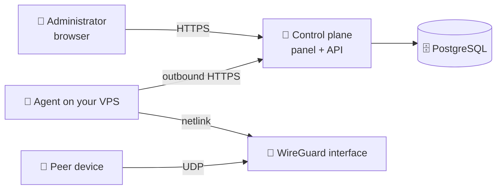

# PeerBlade

**Self-hosted control plane for WireGuard.** One panel for your nodes, peers and
configurations — running in your own infrastructure.

🌐 [peerblade.com](https://peerblade.com) · ❓ [FAQ](https://peerblade.com/faq)
· ✉️ [info@peerblade.com](mailto:info@peerblade.com)

---

## What it is

WireGuard itself is simple. Managing it stops being simple the moment you have
a second server: configuration files edited by hand, peers tracked in a note,
no single place that tells you what is actually connected.

PeerBlade is the missing management layer:

- 🗂 **Node registry** — every VPS with agent status, interfaces and the live
  WireGuard state
- 👥 **Peer lifecycle** — create, disable, re-enable and delete access without
  touching `wg.conf`
- 📄 **Configurations** — hand out a `.conf` file or a QR code straight from the
  panel
- 📊 **Live state** — handshakes, RX/TX counters and snapshot freshness per node
- 🧾 **Audit trail** — sign-ins and administrative operations, never passwords,
  tokens or private keys

## What it is not

- 🚫 **Not a VPN provider.** Your traffic never passes through PeerBlade
  infrastructure. The servers are yours.
- 🚫 **Not an SSH-based tool.** PeerBlade never opens a session to your VPS.
- 🚫 **Not open source.** More on that [below](#repository-and-licensing).

## How it works



Two moving parts:

**The control plane** — the panel, the API and PostgreSQL. You deploy it on a
Linux host behind a reverse proxy with TLS.

**The agent** — a small native binary on each WireGuard node. It runs as its own
system user with a single Linux capability (`CAP_NET_ADMIN`) and dials **out** to
the control plane over HTTPS. Nothing connects inward, so no port has to be
opened for management and no SSH credentials are shared.

The agent reports snapshots of the interfaces it can see and applies the changes
you request. Peer private keys are generated on the node and stay there — the
control plane only ever stores public keys, and a private key reaches you once,
at the moment a configuration is issued.

Shut the panel down and the tunnels keep running: WireGuard on your servers is
untouched, and you can still manage it with `wg` and `wg-quick`.

## Deployment

Everything below runs from this repository: it holds the Compose file, the
reverse-proxy configuration, a bootstrap script for the control plane and an
interface setup script for the nodes. There is no source tree to clone and
nothing to compile — the services are published as container images on
GHCR, and the node agent is attached to each GitHub release.

### What you need

Nothing on your own computer — every command below runs on the server over
SSH, and a freshly provisioned machine is the expected starting point.

- 🖥 **A Linux server for the control plane** — Debian or Ubuntu with root
  access, 2 GB RAM, ports 80 and 443 free. `x86_64` and `arm64` both work, so
  the cheaper Ampere or Graviton instances are fine.
- 🌐 **A DNS name pointing at it** — an `A` (and optionally `AAAA`) record. It
  must resolve *before* the first start: Caddy requests a Let's Encrypt
  certificate on boot.
- 🐧 **One or more WireGuard nodes** — `x86_64` or `arm64` Linux with systemd
  and outbound HTTPS to the panel; the installer picks the matching agent
  build. To let PeerBlade manage a dedicated interface, the node also needs
  `wireguard-tools` and `iptables`.
- 🔓 **An open UDP port on each node** for your peers — that one is for
  WireGuard itself, not for PeerBlade

You do not have to buy a domain — any DNS name that resolves to the host will
do, including a free one such as `203-0-113-10.sslip.io` (resolves to the IP
encoded in it, no registration) or a DuckDNS subdomain. A bare IP address will
not work: the panel needs a real certificate, because the session cookie is
`Secure` and the agent installer refuses anything but HTTPS — that is the same
channel agent tokens travel over.

A laptop is not a substitute for the server: Let's Encrypt validates the domain
from the outside, which a machine behind NAT cannot answer. Docker Desktop does
not fit either — it shares only a few host paths, and the Compose file mounts
its proxy configuration from the deployment directory.

The control plane and a WireGuard node may live on the same machine, but keeping
them apart is the better default.

### 1. Control plane

Everything from here on happens on the server, as root — which is what a fresh
machine gives you. As another user, prefix the commands with `sudo`. Open a
session:

```bash
ssh root@panel.example.com
```

**1.1 — Prepare a bare server.** Skip what is already installed; on a fresh
machine none of it is:

```bash
apt-get update && apt-get install -y curl git ca-certificates
curl -fsSL https://get.docker.com | sh
docker --version && docker compose version
```

**1.2 — Fetch the deployment bundle and generate the secrets.** Replace
`panel.example.com` with your own DNS name — it goes into the certificate, the
API origin and the address agents will report to:

```bash
git clone https://github.com/peerblade/PeerBlade.git /opt/peerblade
cd /opt/peerblade
./bootstrap.sh panel.example.com
```

`bootstrap.sh` writes `.env`, a PostgreSQL password and a Basic Auth
administrator, whose credentials land in `admin-credentials.txt` (mode 0600).
It never overwrites either file, so re-running it cannot wipe your credentials.
If you prefer to fill things in by hand, copy [`.env.example`](.env.example) to
`.env` instead — every variable is documented there.

**1.3 — Start the stack.**

```bash
docker compose pull
docker compose up -d
```

Bringing the stack up starts PostgreSQL, applies the database migrations
(a one-shot `migrate` service that must complete before the API starts), then
the API, the web panel and Caddy. Watch it settle:

```bash
docker compose ps
docker compose logs -f caddy
```

Certificate issuance is the step most likely to fail, and the Caddy log says
why — almost always DNS not yet pointing at the host, or port 80 blocked.

### 2. First administrator

Open `https://panel.example.com`. While `PEERBLADE_AUTH_PROXY_MODE=basic` the
reverse proxy asks for a login and password first — that gate exists so a fresh
installation is never exposed before the account is created. Print them:

```bash
cat /opt/peerblade/admin-credentials.txt
```

With an empty database the panel shows **Set up PeerBlade** and asks you to
create the administrator of this installation. Afterwards the initial setup is
blocked at the database level and the panel shows the sign-in form instead.

Once you have the account, drop the extra gate:

```bash
cd /opt/peerblade
sed -i 's/^PEERBLADE_AUTH_PROXY_MODE=.*/PEERBLADE_AUTH_PROXY_MODE=app/' .env
docker compose up -d caddy
```

Further accounts are added from **Settings → Panel accounts**. There is no
public registration: accounts are local to your installation and live in your
database.

### 3. WireGuard node

This step runs on the WireGuard node, not on the control plane host. In the
panel: **Servers → Connect a server**. It returns a one-time install command
with the token already filled in — copy it from the panel and run it there. It
looks like this:

```bash
curl -fsSL 'https://panel.example.com/install-agent.sh' | \
  sudo bash -s -- --url 'https://panel.example.com' --token '<enrollment token>'
```

The installer downloads the agent binary, verifies its SHA-256 checksum,
exchanges the short-lived enrollment token for a permanent agent token and
starts a systemd unit. The enrollment token is valid for 15 minutes and
single-use. Verify it came up:

```bash
systemctl status peerblade-agent --no-pager
journalctl -u peerblade-agent -n 30 --no-pager
```

The server appears **online** in the panel within a snapshot interval.

Note what the installer deliberately does **not** do: it never creates,
modifies or removes WireGuard interfaces. Existing interfaces are read and shown
as imported, and PeerBlade will not touch them.

### 4. A managed interface

The agent is connected, but it will not create anything yet: it needs one
interface that PeerBlade owns. This step is deliberately separate — you decide
the interface name, its address range and its public endpoint.

**4.1 — Create the interface.** Skip to 4.2 if the node already has one for
PeerBlade. Otherwise install WireGuard itself — the agent speaks to the kernel
directly, but creating an interface needs the userspace tools:

```bash
apt-get update && apt-get install -y wireguard-tools iptables
```

Then download the script and run it. It writes `/etc/wireguard/peerblade0.conf`
with a fresh key, enables IPv4 forwarding and NAT and starts `wg-quick`; it
refuses to overwrite an existing configuration or interface, so it is safe to
run on a node that already has WireGuard:

```bash
curl -fsSL -o /tmp/setup-wireguard.sh \
  https://raw.githubusercontent.com/peerblade/PeerBlade/main/setup-wireguard.sh
chmod +x /tmp/setup-wireguard.sh
/tmp/setup-wireguard.sh peerblade0 10.8.0.1/24 51822 \
  "$(ip route get 1.1.1.1 | grep -oP 'dev \K\S+')"
```

Check that it came up before going on — 4.2 reads its settings from the running
interface:

```bash
wg show peerblade0
```

The arguments are the interface name, its address, the UDP port and the node's
outbound interface — the command above fills the last one in for you.

**Open the port, and allow forwarding.** Peers connect to the UDP port
directly, and it is the one port PeerBlade cannot open for you. Many providers
ship an image with `ufw` enabled and everything but SSH and HTTP denied, which
silently prevents any handshake. Skip this if `ufw status` says inactive:

```bash
ufw allow 51822/udp
ufw route allow in on peerblade0 out on ens3
ufw route allow in on ens3 out on peerblade0
```

Replace `ens3` with the node's outbound interface — `ip route get 1.1.1.1`
prints it. The two kinds of rule do different jobs and both are needed: the
first lets peers reach the node, the second lets their traffic pass *through*
it. With only the first, the tunnel connects, the handshake succeeds and
nothing loads — and the evidence is in `dmesg`:

```
[UFW BLOCK] IN=peerblade0 OUT=ens3 SRC=10.8.0.2 DST=1.1.1.1 PROTO=UDP DPT=53
```

If the provider also has a firewall of its own — a cloud security group or DDoS
filtering — the UDP port has to be open there too.

**4.2 — Point the agent at the interface.** Replace `node.example.com` with the
address your peers will connect to, then run the whole block as one command —
the port and the address are read from the node itself and written into the
agent configuration:

```bash
tee -a /etc/peerblade/agent.env >/dev/null <<EOF
PEERBLADE_MANAGED_INTERFACE=peerblade0
PEERBLADE_MANAGED_ENDPOINT=node.example.com:$(wg show peerblade0 listen-port)
PEERBLADE_MANAGED_ADDRESS_CIDR=$(ip -4 -brief addr show peerblade0 | awk '{print $3}')
PEERBLADE_MANAGED_ALLOWED_IPS=0.0.0.0/0
PEERBLADE_MANAGED_DNS=1.1.1.1
PEERBLADE_STATE_DIRECTORY=/var/lib/peerblade-agent
EOF
```

If you named the interface something other than `peerblade0` in 4.1, replace it
in all three places. The endpoint goes into every peer configuration, so it has
to be an address reachable from the outside — a DNS name or the node's public
IP, never `localhost` or a private address.

`PEERBLADE_MANAGED_ALLOWED_IPS=0.0.0.0/0` means a full tunnel: everything the
peer sends travels through the node. That makes `PEERBLADE_MANAGED_DNS`
practically mandatory — without it the client keeps its previous resolver,
which usually sits on its local network and becomes unreachable the moment the
tunnel comes up. The symptom is a connected tunnel with no working internet.
Put any resolver you trust there; both values end up in every configuration the
panel issues from now on, and configurations issued earlier keep what they had.

**4.3 — Restart the agent and check it.**

```bash
systemctl restart peerblade-agent
journalctl -u peerblade-agent -n 30 --no-pager
```

Once you hand a configuration to a device, `wg show` on the node tells you
whether it ever arrived: a peer with no `latest handshake` line has never
reached the node, which is a firewall or endpoint problem rather than anything
inside PeerBlade. If the handshake is there but nothing loads, check that
forwarding survives the firewall — `ufw` defaults to dropping forwarded
packets:

```bash
wg show
iptables -S FORWARD | head
```

A healthy start reports the managed interface. If a message says
`... is required for native peer management`, one of the four variables above is
missing or empty — check what landed in the file:

```bash
grep PEERBLADE_MANAGED /etc/peerblade/agent.env
```

You can now create peers for this server in the panel.

The agent keeps its peers in `peers.json` inside the state directory and
reconciles the interface against it on every start, so a reboot or a lost
`wg` state does not lose peers.

> **Reinstalling an agent.** Removing a server from the panel with the full
> removal option deletes `/etc/peerblade/agent.env`, so a reinstalled agent
> comes back without the settings from 4.2 and cannot create peers until you
> add them again. The state directory survives, so once you do, the peers that
> were on the node return with their names.

### 5. More nodes

Each node gets its own agent, its own interface and its own endpoint. Give every
node a distinct address range (`10.8.0.0/24`, `10.9.0.0/24`, …) so peer
addressing never collides, and name the endpoints so a peer configuration tells
you where it connects.

### Updates

`PEERBLADE_IMAGE_TAG=latest` follows the newest release, which is the default.
Updating then means pulling the new images:

```bash
cd /opt/peerblade
git pull                       # Compose file and proxy configuration
docker compose pull
docker compose up -d           # migrations run automatically
```

For reproducible deployments, pin a version instead and raise it when you
choose to update — this sets the pin and applies it in one go:

```bash
cd /opt/peerblade
sed -i 's/^PEERBLADE_IMAGE_TAG=.*/PEERBLADE_IMAGE_TAG=0.2.0/' .env
docker compose pull && docker compose up -d
```

Agents update independently: re-run the install command from the panel on a
node, or replace the binary and restart `peerblade-agent`. Tunnels stay up while
the agent restarts — the interface belongs to the kernel, not to the process.

### Backups

Everything worth keeping is in PostgreSQL:

```bash
mkdir -p /root/peerblade-backups
docker compose exec -T postgres \
  pg_dump -U peerblade -d peerblade -Fc \
  > /root/peerblade-backups/peerblade-$(date +%F).dump
```

Keep `.env` alongside the dump — without `POSTGRES_PASSWORD` the volume is not
much use. Peer private keys are *not* in the dump by design; they live on the
nodes and in the configurations you handed out.

## Security model

- 🔑 Peer private keys and preshared keys never leave your node
- 🙈 Snapshots carry public keys and counters, never key material
- 📤 The agent only makes outbound connections; no inbound management port
- 🧊 Passwords are stored as scrypt hashes; sessions live in HttpOnly cookies
- 🧾 Administrative actions are written to an audit log with IP and user agent
- 🛡 The agent unit is hardened: dedicated user, `CAP_NET_ADMIN` only, read-only
  filesystem, restricted namespaces, devices and address families

## Repository and licensing

**PeerBlade is not open source at this stage.** The source code is proprietary
and is not distributed under any open-source license.

This repository holds what you need to run the service — the Compose file, the
reverse-proxy configuration, the bootstrap script and the documentation. The
application itself ships as container images on GHCR; its source code is not
published here or anywhere else.

**You may** deploy PeerBlade in your own infrastructure for your own or your
organisation's use, run as many nodes and peers as you like, adapt the
configuration in this repository to your environment, and write about PeerBlade
in reviews, articles and comparisons.

**You may not**, without the rights holder's consent, extract the source from
the images or reverse-engineer them, redistribute the images under another
name, or offer a service based on PeerBlade to third parties.

Self-hosted and open source are different things: you run PeerBlade in your own
infrastructure, while the rights to the code stay with the rights holder. The
authoritative wording is in the [Terms](https://peerblade.com/terms).

## Status

Under active development. The feature set may change, and interfaces may move
before a stable release.

Questions, bug reports and feedback: **[info@peerblade.com](mailto:info@peerblade.com)**

---

<sub>© 2026 PeerBlade. All rights reserved. ·
[Privacy](https://peerblade.com/privacy) ·
[Terms](https://peerblade.com/terms)</sub>
