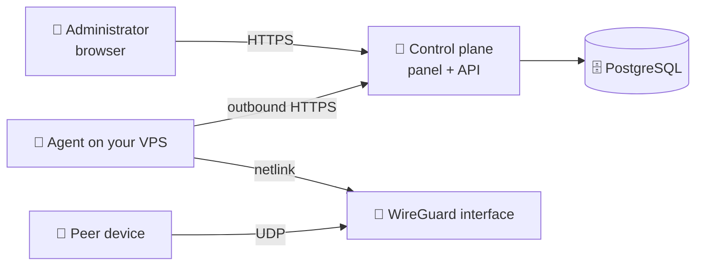

# PeerBlade

**Self-hosted control plane for WireGuard.** One panel for your nodes, peers and
configurations — running in your own infrastructure.

🌐 [peerblade.com](https://peerblade.com) · ❓ [FAQ](https://peerblade.com/faq)
· ✉️ [info@peerblade.com](mailto:info@peerblade.com)

---

## What it is

WireGuard itself is simple. Managing it stops being simple the moment you have
a second server: configuration files edited by hand, peers tracked in a note,
no single place that tells you what is actually connected.

PeerBlade is the missing management layer:

- 🗂 **Node registry** — every VPS with agent status, interfaces and the live
  WireGuard state
- 👥 **Peer lifecycle** — create, disable, re-enable and delete access without
  touching `wg.conf`
- 📄 **Configurations** — hand out a `.conf` file or a QR code straight from the
  panel
- 📊 **Live state** — handshakes, RX/TX counters and snapshot freshness per node
- 🧾 **Audit trail** — sign-ins and administrative operations, never passwords,
  tokens or private keys

## What it is not

- 🚫 **Not a VPN provider.** Your traffic never passes through PeerBlade
  infrastructure. The servers are yours.
- 🚫 **Not an SSH-based tool.** PeerBlade never opens a session to your VPS.
- 🚫 **Not open source.** More on that [below](#repository-and-licensing).

## How it works



Two moving parts:

**The control plane** — the panel, the API and PostgreSQL. You deploy it on a
Linux host behind a reverse proxy with TLS.

**The agent** — a small native binary on each WireGuard node. It runs as its own
system user with a single Linux capability (`CAP_NET_ADMIN`) and dials **out** to
the control plane over HTTPS. Nothing connects inward, so no port has to be
opened for management and no SSH credentials are shared.

The agent reports snapshots of the interfaces it can see and applies the changes
you request. Peer private keys are generated on the node and stay there — the
control plane only ever stores public keys, and a private key reaches you once,
at the moment a configuration is issued.

Shut the panel down and the tunnels keep running: WireGuard on your servers is
untouched, and you can still manage it with `wg` and `wg-quick`.

## Deployment

Everything below runs from this repository: it contains the Compose file, the
reverse-proxy configuration and a bootstrap script. There is no source tree to
clone and nothing to compile — the services are published as container images on
GHCR, and the node agent is attached to each GitHub release.

### What you need

- 🐧 **A Linux host for the control plane** — Docker Engine with Compose v2,
  ports 80 and 443 free, 1 GB RAM is enough
- 🌐 **A domain for the panel** — an `A` (and optionally `AAAA`) record pointing
  at that host. It must resolve *before* the first start: Caddy requests a
  Let's Encrypt certificate on boot.
- 🐧 **One or more WireGuard nodes** — Ubuntu or Debian x86_64 with systemd and
  the `wireguard-tools` package, plus outbound HTTPS to the panel
- 🔓 **An open UDP port on each node** for your peers — that one is for
  WireGuard itself, not for PeerBlade

The control plane and a WireGuard node may live on the same machine, but keeping
them apart is the better default.

### 1. Control plane

```bash
sudo git clone https://github.com/peerblade/peerblade.git /opt/peerblade
cd /opt/peerblade

# Generates .env, the PostgreSQL password and a Basic Auth administrator.
# Credentials are written to admin-credentials.txt (mode 0600).
sudo ./bootstrap.sh panel.example.com

sudo docker compose pull
sudo docker compose up -d
```

`bootstrap.sh` never overwrites an existing `.env` or `admin-credentials.txt`,
so re-running it cannot wipe your credentials. If you prefer to fill things in
by hand, copy [`.env.example`](.env.example) to `.env` instead — every variable
is documented there.

Bringing the stack up starts PostgreSQL, applies the database migrations
(a one-shot `migrate` service that must complete before the API starts), then
the API, the web panel and Caddy. Watch it settle:

```bash
sudo docker compose ps
sudo docker compose logs -f caddy
```

Certificate issuance is the step most likely to fail, and the Caddy log says
why — almost always DNS not yet pointing at the host, or port 80 blocked.

### 2. First administrator

Open `https://panel.example.com`. While `PEERBLADE_AUTH_PROXY_MODE=basic` the
reverse proxy asks for the Basic Auth credentials from
`admin-credentials.txt` first — that gate exists so a fresh installation is
never exposed before the account is created.

With an empty database the panel shows **Set up PeerBlade** and asks you to
create the administrator of this installation. Afterwards the initial setup is
blocked at the database level and the panel shows the sign-in form instead.

Once you have the account, drop the extra gate:

```bash
sudo sed -i 's/^PEERBLADE_AUTH_PROXY_MODE=.*/PEERBLADE_AUTH_PROXY_MODE=app/' .env
sudo docker compose up -d caddy
```

Further accounts are added from **Settings → Panel accounts**. There is no
public registration: accounts are local to your installation and live in your
database.

### 3. WireGuard node

In the panel: **Servers → Add server**. It returns a one-time install command —
run it on the node as root:

```bash
curl -fsSL 'https://panel.example.com/install-agent.sh' | \
  sudo bash -s -- --url 'https://panel.example.com' --token '<enrollment token>'
```

The installer downloads the agent binary, verifies its SHA-256 checksum,
exchanges the short-lived enrollment token for a permanent agent token and
starts a systemd unit. The enrollment token is valid for 15 minutes and
single-use. Verify it came up:

```bash
systemctl status peerblade-agent
journalctl -u peerblade-agent -f
```

The server appears **online** in the panel within a snapshot interval.

Note what the installer deliberately does **not** do: it never creates,
modifies or removes WireGuard interfaces. Existing interfaces are read and shown
as imported. Handing a dedicated interface over to PeerBlade is a separate,
explicit step — you decide the interface name, its address range and its public
endpoint.

### 4. More nodes

Each node gets its own agent, its own interface and its own endpoint. Give every
node a distinct address range (`10.8.0.0/24`, `10.9.0.0/24`, …) so peer
addressing never collides, and name the endpoints so a peer configuration tells
you where it connects.

### Updates

`PEERBLADE_IMAGE_TAG=latest` follows the newest release. Pin a version in `.env`
for reproducible deployments — `PEERBLADE_IMAGE_TAG=0.1.0` — and raise it when
you choose to update:

```bash
cd /opt/peerblade
sudo git pull                       # Compose file and proxy configuration
sudo docker compose pull
sudo docker compose up -d           # migrations run automatically
```

Agents update independently: re-run the install command from the panel on a
node, or replace the binary and restart `peerblade-agent`. Tunnels stay up while
the agent restarts — the interface belongs to the kernel, not to the process.

### Backups

Everything worth keeping is in PostgreSQL:

```bash
sudo mkdir -p /root/peerblade-backups
sudo docker compose exec -T postgres \
  pg_dump -U peerblade -d peerblade -Fc \
  > /root/peerblade-backups/peerblade-$(date +%F).dump
```

Keep `.env` alongside the dump — without `POSTGRES_PASSWORD` the volume is not
much use. Peer private keys are *not* in the dump by design; they live on the
nodes and in the configurations you handed out.

## Security model

- 🔑 Peer private keys and preshared keys never leave your node
- 🙈 Snapshots carry public keys and counters, never key material
- 📤 The agent only makes outbound connections; no inbound management port
- 🧊 Passwords are stored as scrypt hashes; sessions live in HttpOnly cookies
- 🧾 Administrative actions are written to an audit log with IP and user agent
- 🛡 The agent unit is hardened: dedicated user, `CAP_NET_ADMIN` only, read-only
  filesystem, restricted namespaces, devices and address families

## Repository and licensing

**PeerBlade is not open source at this stage.** The source code is proprietary
and is not distributed under any open-source license. This repository is public
only to describe the product — it holds no source code.

Self-hosted and open source are different things: you run PeerBlade in your own
infrastructure, while the rights to the code stay with the rights holder.

## Status

Under active development. The feature set may change, and interfaces may move
before a stable release.

Questions, bug reports and feedback: **[info@peerblade.com](mailto:info@peerblade.com)**

---

<sub>© 2026 PeerBlade. All rights reserved. ·
[Privacy](https://peerblade.com/privacy) ·
[Terms](https://peerblade.com/terms)</sub>
