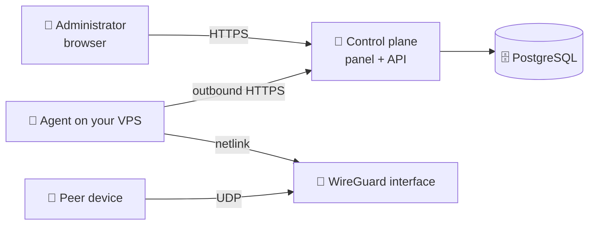

# PeerBlade

**Self-hosted control plane for WireGuard.** One panel for your nodes, peers and
configurations — running in your own infrastructure.

🌐 [peerblade.com](https://peerblade.com) · ❓ [FAQ](https://peerblade.com/faq)
· ✉️ [info@peerblade.com](mailto:info@peerblade.com)

---

## What it is

WireGuard itself is simple. Managing it stops being simple the moment you have
a second server: configuration files edited by hand, peers tracked in a note,
no single place that tells you what is actually connected.

PeerBlade is the missing management layer:

- 🗂 **Node registry** — every VPS with agent status, interfaces and the live
  WireGuard state
- 👥 **Peer lifecycle** — create, disable, re-enable and delete access without
  touching `wg.conf`
- 📄 **Configurations** — hand out a `.conf` file or a QR code straight from the
  panel
- 📊 **Live state** — handshakes, RX/TX counters and snapshot freshness per node
- 🧾 **Audit trail** — sign-ins and administrative operations, never passwords,
  tokens or private keys

## What it is not

- 🚫 **Not a VPN provider.** Your traffic never passes through PeerBlade
  infrastructure. The servers are yours.
- 🚫 **Not an SSH-based tool.** PeerBlade never opens a session to your VPS.
- 🚫 **Not open source.** More on that [below](#repository-and-licensing).

## How it works

Two moving parts:

**The control plane** — the panel, the API and PostgreSQL. You deploy it on a
Linux host behind a reverse proxy with TLS.

**The agent** — a small native binary on each WireGuard node. It runs as its own
system user with a single Linux capability (`CAP_NET_ADMIN`) and dials **out** to
the control plane over HTTPS. Nothing connects inward, so no port has to be
opened for management and no SSH credentials are shared.

The agent reports snapshots of the interfaces it can see and applies the changes
you request. Peer private keys are generated on the node and stay there — the
control plane only ever stores public keys, and a private key reaches you once,
at the moment a configuration is issued.

Shut the panel down and the tunnels keep running: WireGuard on your servers is
untouched, and you can still manage it with `wg` and `wg-quick`.

## Deployment

### What you need

- 🐧 A Linux host for the control plane: Docker with Compose v2, a domain and
  DNS records pointing at it
- 🐧 One or more WireGuard nodes: Ubuntu or Debian x86_64 with systemd and
  WireGuard installed
- 🔓 An open UDP port on each node for your peers — that one is for WireGuard
  itself, not for PeerBlade

### 1. Control plane

A bootstrap step generates the secrets: an administrator password for the
reverse proxy, a PostgreSQL password and the environment file. It never
overwrites an existing one, so re-running it cannot wipe your credentials.

The deploy step then builds the images, applies database migrations and brings
up PostgreSQL, the API, the web panel and the reverse proxy. TLS certificates
are issued automatically on first start, which is why DNS has to be ready
beforehand.

The panel can additionally sit behind HTTP Basic Auth while you are still
setting things up — a single switch flips between "proxy asks for a password"
and "application login only".

### 2. First administrator

Open the panel. With an empty database it shows **Set up PeerBlade** and asks you
to create the administrator of this installation; afterwards the initial setup is
blocked at the database level and the panel shows the sign-in form instead.

Further accounts are added from **Settings → Panel accounts**. There is no public
registration: accounts are local to your installation and live in your database.

### 3. WireGuard node

Add the server in the panel, then run the one-time install command it gives you.
The installer downloads the agent binary, verifies its SHA-256 checksum,
exchanges a short-lived enrollment token for a permanent agent token and starts
the service. The enrollment is valid for 15 minutes and single-use.

Note what the installer deliberately does **not** do: it never creates, modifies
or removes WireGuard interfaces. Existing interfaces are read and shown as
imported. Handing a dedicated interface over to PeerBlade is a separate,
explicit step — you decide the interface name, its address range and its public
endpoint.

### 4. More nodes

Each node gets its own agent, its own interface and its own endpoint. Give every
node a distinct address range so peer addressing never collides, and name the
endpoints so a peer configuration tells you where it connects.

## Security model

- 🔑 Peer private keys and preshared keys never leave your node
- 🙈 Snapshots carry public keys and counters, never key material
- 📤 The agent only makes outbound connections; no inbound management port
- 🧊 Passwords are stored as scrypt hashes; sessions live in HttpOnly cookies
- 🧾 Administrative actions are written to an audit log with IP and user agent
- 🛡 The agent unit is hardened: dedicated user, `CAP_NET_ADMIN` only, read-only
  filesystem, restricted namespaces, devices and address families

## Repository and licensing

**PeerBlade is not open source at this stage.** The source code is proprietary
and is not distributed under any open-source license. This repository is public
only to describe the product — it holds no source code.

Self-hosted and open source are different things: you run PeerBlade in your own
infrastructure, while the rights to the code stay with the rights holder.

## Status

Under active development. The feature set may change, and interfaces may move
before a stable release.

Questions, bug reports and feedback: **[info@peerblade.com](mailto:info@peerblade.com)**

---

© 2026 PeerBlade. All rights reserved. ·
[Privacy](https://peerblade.com/privacy) ·
[Terms](https://peerblade.com/terms)
