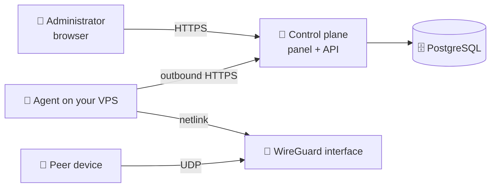

# PeerBlade

**PeerBlade is a self-hosted control plane for WireGuard.** One panel for your
nodes, peers and configurations — running in your own infrastructure.

This repository contains the product documentation and everything needed to
deploy it. The Linux node agent is open source under GPL-3.0-or-later; the web
panel and control-plane API remain proprietary.

See [LICENSING.md](LICENSING.md) for the exact component boundaries.

🌐 [peerblade.com](https://peerblade.com) · ❓ [FAQ](https://peerblade.com/faq)
· ✉️ [feedback@peerblade.com](mailto:feedback@peerblade.com)

📋 [Changelog](CHANGELOG.md) — panel, agent and deployment changes with
upgrade requirements for every release.

---

## What it is

WireGuard itself is simple. Managing it stops being simple the moment you have
a second server: configuration files edited by hand, peers tracked in a note,
no single place that tells you what is actually connected.

PeerBlade is the missing management layer:

- 🗂 **Node registry** — every VPS with agent status, interfaces and the live
  WireGuard state
- 👥 **Peer lifecycle** — create, disable, re-enable and delete access without
  touching `wg.conf`
- 📄 **Configurations** — hand out a `.conf` file or a QR code straight from the
  panel
- 📊 **Live state** — handshakes, RX/TX counters and snapshot freshness per node
- 🧾 **Audit trail** — sign-ins and administrative operations, never passwords,
  tokens or private keys

## What it is not

- 🚫 **Not a VPN provider.** Your traffic never passes through PeerBlade
  infrastructure. The servers are yours.
- 🚫 **Not an SSH-based tool.** PeerBlade never opens a session to your VPS.
- 🔎 **Open-source agent.** The privileged code running on WireGuard nodes is
  published in [`agent/`](agent/); the control plane remains proprietary.

## How it works



Two moving parts:

**The control plane** — the panel, the API and PostgreSQL. You deploy it on a
Linux host behind a reverse proxy with TLS.

**The agent** — a small native binary on each WireGuard node. It runs as its own
system user with a single Linux capability (`CAP_NET_ADMIN`) and dials **out** to
the control plane over HTTPS. Nothing connects inward, so no port has to be
opened for management and no SSH credentials are shared.

Its complete source, installer scripts, protocol description, security model
and public release workflow are available in [`agent/`](agent/).
Agent releases use independent `agent-vX.Y.Z` tags; the control-plane images
continue to use product tags in the form `vX.Y.Z`.

The agent reports snapshots of the interfaces it can see and applies the changes
you request. Peer private keys are generated on the node and stay there — the
control plane only ever stores public keys, and a private key reaches you once,
at the moment a configuration is issued.

Shut the panel down and the tunnels keep running: WireGuard on your servers is
untouched, and you can still manage it with `wg` and `wg-quick`.

## Deployment

One command installs the control plane —
`curl -fsSL https://peerblade.com/install.sh | sudo bash -s -- panel.example.com` —
and the steps below spell out what it does, for anyone who would rather see it.

Everything runs from this repository: it holds the Compose file, the
reverse-proxy configuration, a bootstrap script for the control plane and an
interface setup script for the nodes. There is no source tree to clone and
nothing to compile — the services are published as container images on
GHCR. Product releases include a compatible node-agent binary, while the same
agent source is built publicly under its independent `agent-vX.Y.Z` tag.

### What you need

Nothing on your own computer — every command below runs on the server over
SSH, and a freshly provisioned machine is the expected starting point.

- 🖥 **A Linux server for the control plane** — Debian or Ubuntu with root
  access, 2 GB RAM, ports 80 and 443 free. `x86_64` and `arm64` both work, so
  the cheaper Ampere or Graviton instances are fine.
- 🌐 **A DNS name pointing at it** — an `A` (and optionally `AAAA`) record. It
  must resolve *before* the first start: Caddy requests a Let's Encrypt
  certificate on boot.
- 🐧 **One or more WireGuard nodes** — `x86_64` or `arm64` Linux with systemd
  and outbound HTTPS to the panel; the installer picks the matching agent build
  and installs `wireguard-tools` where it is missing. The control plane host
  itself can be the first node — see `--with-node` in step 1.
- 🔓 **An open UDP port on each node** for your peers — 51820 by default. The
  installer opens it in ufw; a firewall outside the machine, such as a cloud
  security group, is yours to open

<details>
<summary>No domain to spare, or thinking of using your laptop?</summary>

You do not have to buy a domain — any DNS name that resolves to the host will
do, including a free one such as `203-0-113-10.sslip.io` (resolves to the IP
encoded in it, no registration) or a DuckDNS subdomain. A bare IP address will
not work: the panel needs a real certificate, because the session cookie is
`Secure` and the agent installer refuses anything but HTTPS — that is the same
channel agent tokens travel over.

A laptop is not a substitute for the server: Let's Encrypt validates the domain
from the outside, which a machine behind NAT cannot answer. Docker Desktop does
not fit either — it shares only a few host paths, and the Compose file mounts
its proxy configuration from the deployment directory.

The control plane and a WireGuard node may live on the same machine, but keeping
them apart is the better default.

</details>

### 1. Control plane

Everything from here on happens on the server, as root — which is what a fresh
machine gives you. As another user, prefix the commands with `sudo`. Open a
session:

```bash
ssh root@panel.example.com
```

**In one command.** The installer does everything in 1.1 to 1.3 below: installs
Docker, fetches this bundle, generates the secrets and starts the stack. It
refuses to start if the name does not resolve to this host or if ports 80 and
443 are taken, and re-running it updates an existing installation rather than
overwriting it.

After the first successful deployment it sends one anonymous receipt to
`peerblade.com`: a random installation UUID used only to count unique
deployments. No domain, IP, account, node, peer or traffic data is included,
and updates do not send it again. Pass `--no-installation-receipt` to opt out;
the manual deployment steps send nothing.

```bash
curl -fsSL https://peerblade.com/install.sh | sudo bash -s -- panel.example.com
```

**One machine for everything?** Add `--with-node` and the same host also becomes
your first VPN node: the installer registers it, prepares a WireGuard interface
on UDP 51820 and connects the agent, so the panel opens with a server already
online and steps 2 and 3 collapse into this one. `--vpn-port` moves the tunnel
elsewhere if 51820 is taken.

```bash
curl -fsSL https://peerblade.com/install.sh | sudo bash -s -- panel.example.com --with-node
```

<details>
<summary>Rather not pipe a script into a shell?</summary>

A fair objection — you are running unread code as root. Read it first, then
run it; it is about a hundred lines and pulls nothing but `apt`, the official
Docker installer and this repository:

```bash
curl -fsSL https://peerblade.com/install.sh -o install.sh
less install.sh
sudo bash install.sh panel.example.com
```

Or ignore it entirely and follow the numbered steps below, which is what the
script automates.

</details>

**1.1 — Prepare a bare server.** Skip what is already installed; on a fresh
machine none of it is:

```bash
apt-get update && apt-get install -y curl git ca-certificates
curl -fsSL https://get.docker.com | sh
docker --version && docker compose version
```

**1.2 — Fetch the deployment bundle and generate the secrets.** Replace
`panel.example.com` with your own DNS name — it goes into the certificate, the
API origin and the address agents will report to:

```bash
sudo git clone https://github.com/peerblade/PeerBlade.git /opt/peerblade
cd /opt/peerblade
sudo ./bootstrap.sh panel.example.com
```

<details>
<summary>What bootstrap.sh writes</summary>

`.env`, a PostgreSQL password and a random first-run token. The raw token lands
only in `setup-url.txt`; `.env` stores its SHA-256 hash and expiry. Both files
use mode `0600`, and bootstrap never overwrites them. To fill things in by hand
instead, copy [`.env.example`](.env.example) to `.env`, then run
`sudo ./setup-token.sh panel.example.com`.

</details>

**1.3 — Start the stack.**

```bash
docker compose pull
docker compose up -d
```

```bash
docker compose ps
docker compose logs -f caddy
```

<details>
<summary>What should happen, and what usually goes wrong</summary>

PostgreSQL starts, the database migrations run as a one-shot `migrate` service
that must finish before the API starts, then the API, the web panel and Caddy
come up. In `docker compose ps` everything reads `running` except `migrate`,
which reads `exited (0)`.

Certificate issuance is the step most likely to fail, and the Caddy log says
why — almost always DNS not yet pointing at the host, or port 80 blocked.

</details>

### 2. First administrator

Print the one-time setup link on the server:

```bash
sudo cat /opt/peerblade/setup-url.txt
```

Open that URL. With an empty database the panel shows **Set up PeerBlade** and
asks you to create the administrator of this installation. The link expires
after 60 minutes and becomes useless as soon as the administrator exists.

If the link expires before setup, replace it and restart only the API:

```bash
cd /opt/peerblade
sudo ./setup-token.sh
docker compose up -d --force-recreate api
```

<details>
<summary>Why the setup link is safe, and how further accounts work</summary>

The token contains 256 random bits and stays after `#` in the URL, so it is not
part of the initial HTTP request or reverse-proxy access logs. The browser sends
it only in the administrator-creation request; PeerBlade stores and compares
only its SHA-256 hash. Keep `setup-url.txt` private and delete it after setup.

After the first administrator, the initial setup is blocked at the database
level and the panel shows the sign-in form instead. Further accounts are added
from **Settings → Panel accounts**; there is no public registration, and
accounts are local to your installation.

</details>

### 3. WireGuard node

This step runs on the WireGuard node, not on the control plane host. In the
panel: **Servers → Connect a server**. It returns a one-time command with the
token and the endpoint already filled in — copy it from the panel and run it
there. It looks like this:

```bash
curl -fsSL 'https://panel.example.com/install-agent.sh' | \
  sudo bash -s -- --url 'https://panel.example.com' --token '<enrollment token>' \
  --endpoint 'node.example.com:51820' \
  --interface 'peerblade0' --subnet '10.44.0.1/24'
```

That single command connects the agent *and* prepares the interface PeerBlade
will manage: it installs `wireguard-tools`, creates `peerblade0` on UDP 51820
with a fresh key, enables IPv4 forwarding and NAT, opens the port and the
forwarding rules in ufw when ufw is active, and points the agent at the result.

Verify it came up:

```bash
systemctl status peerblade-agent --no-pager
wg show peerblade0
```

The server appears **online** in the panel within a snapshot interval, and you
can create peers for it straight away.

<details>
<summary>Changing the port, the interface name or the address range</summary>

Edit the flags before running the command. `--endpoint` is the address peers
will dial, so it has to be reachable from the outside — a DNS name or the
node's public IP, never `localhost` or a private address. Its port is also the
port the interface listens on.

`--subnet` is the node's own address inside the tunnel and must end in `.1/24`.
Give every node a distinct range (`10.44.0.1/24`, `10.45.0.1/24`, …) so a peer
that holds configurations for several nodes never sees the same address twice.

`--dns` sets the resolver written into every peer configuration and defaults to
`1.1.1.1,8.8.8.8`. It matters because peers get a full tunnel: without a
resolver reachable through it, a client keeps its local one, which disappears
the moment the tunnel comes up — a connected tunnel with no working internet.

`--no-interface` installs the agent alone, for a node whose WireGuard you would
rather set up by hand.

</details>

<details>
<summary>What the installer does, and what it refuses to do</summary>

It downloads the agent build matching the node's architecture, verifies its
SHA-256 checksum, exchanges the short-lived enrollment token for a permanent
agent token and starts a systemd unit. The enrollment token is valid for 15
minutes and single-use.

Everything that could stop it — a missing package, an occupied UDP port, no
default route — is checked before the token is spent, so a host that is not
ready costs you nothing but a re-run.

It touches exactly one interface: the one named in `--interface`, and only when
that interface does not exist yet. An interface already present is kept as it
is and simply handed to the agent. Everything else on the node, `wg0` above
all, is read for the snapshot and never modified.

</details>

<details>
<summary>Why the firewall needs two kinds of rule</summary>

The installer adds them for you when ufw is active, but they are worth
understanding, because a missing one looks like a bug in the tunnel:

```bash
ufw allow 51820/udp
ufw route allow in on peerblade0 out on ens3
ufw route allow in on ens3 out on peerblade0
```

The first lets peers *reach* the node, the others let their traffic pass
*through* it. With only the first, the tunnel connects, the handshake succeeds
and nothing loads — the evidence being a line like this in `dmesg`:

```
[UFW BLOCK] IN=peerblade0 OUT=ens3 SRC=10.44.0.2 DST=1.1.1.1 PROTO=UDP DPT=53
```

If your host has a firewall of its own — a cloud security group or DDoS
filtering — the UDP port has to be open there too. That one PeerBlade cannot
reach.

</details>

<details>
<summary>Setting the interface up by hand</summary>

Run the panel's command with `--no-interface`, then do what it would have done.
Install the userspace tools — the agent speaks to the kernel directly, but
creating an interface needs them:

```bash
apt-get update && apt-get install -y wireguard-tools iptables
```

Create the interface:

```bash
curl -fsSL -o /tmp/setup-wireguard.sh \
  https://raw.githubusercontent.com/peerblade/PeerBlade/main/setup-wireguard.sh
chmod +x /tmp/setup-wireguard.sh
/tmp/setup-wireguard.sh peerblade0 10.44.0.1/24 51820 \
  "$(ip route get 1.1.1.1 | grep -oP 'dev \K\S+')"
wg show peerblade0
```

The arguments are the interface name, its address, the UDP port and the node's
outbound interface — the command fills the last one in for you. The script
writes `/etc/wireguard/peerblade0.conf` with a fresh key, enables IPv4
forwarding and NAT and starts `wg-quick`. It refuses to overwrite an existing
configuration or interface.

Then point the agent at it, replacing `node.example.com` with the address your
peers will connect to, and run the block as one command:

```bash
tee -a /etc/peerblade/agent.env >/dev/null <<EOF
PEERBLADE_MANAGED_INTERFACE=peerblade0
PEERBLADE_MANAGED_ENDPOINT=node.example.com:$(wg show peerblade0 listen-port)
PEERBLADE_MANAGED_ADDRESS_CIDR=$(ip -4 -brief addr show peerblade0 | awk '{print $3}')
PEERBLADE_MANAGED_ALLOWED_IPS=0.0.0.0/0
PEERBLADE_MANAGED_DNS=1.1.1.1
PEERBLADE_STATE_DIRECTORY=/var/lib/peerblade-agent
EOF
systemctl restart peerblade-agent
journalctl -u peerblade-agent -n 30 --no-pager
```

A healthy start reports the managed interface. A message saying
`... is required for native peer management` means one of those variables is
missing or empty — usually because the interface was down when the block ran,
so the substitutions produced nothing:

```bash
grep PEERBLADE_MANAGED /etc/peerblade/agent.env
```

</details>

<details>
<summary>Where peers are kept, and what a reinstall loses</summary>

The agent keeps its peers in `peers.json` inside the state directory and
reconciles the interface against it on every start, so a reboot or a lost `wg`
state does not lose peers.

Removing a server from the panel with the full removal option deletes
`/etc/peerblade/agent.env`, so a reinstalled agent comes back without its
managed-interface settings and cannot create peers until they are set again —
running the panel's install command once more does that. The state directory
survives, so the peers that were on the node return with their names.

</details>

### 4. More nodes

Each node gets its own agent, its own interface and its own endpoint. The panel
issues a fresh command for every server you add. Give each one a distinct
address range with `--subnet` (`10.44.0.1/24`, `10.45.0.1/24`, …) so peer
addressing never collides, and name the endpoints so a peer configuration tells
you where it connects.

### Updates

`PEERBLADE_IMAGE_TAG=latest` follows the newest release, which is the default.
Updating then means pulling the new images:

```bash
cd /opt/peerblade
git pull                       # Compose file and proxy configuration
docker compose pull
docker compose up -d           # migrations run automatically
```

For reproducible deployments, pin a version instead and raise it when you
choose to update — this sets the pin and applies it in one go:

```bash
cd /opt/peerblade
sed -i 's/^PEERBLADE_IMAGE_TAG=.*/PEERBLADE_IMAGE_TAG=0.6.0/' .env
docker compose pull && docker compose up -d
```

Agents update independently: re-run the install command from the panel on a
node, or replace the binary and restart `peerblade-agent`. Tunnels stay up while
the agent restarts — the interface belongs to the kernel, not to the process.

### Backups

Everything worth keeping is in PostgreSQL:

```bash
mkdir -p /root/peerblade-backups
docker compose exec -T postgres \
  pg_dump -U peerblade -d peerblade -Fc \
  > /root/peerblade-backups/peerblade-$(date +%F).dump
```

Keep `.env` alongside the dump — without `POSTGRES_PASSWORD` the volume is not
much use. Peer private keys are *not* in the dump by design; they live on the
nodes and in the configurations you handed out.

## Uninstalling PeerBlade

PeerBlade deliberately cannot remove itself from the browser: the containers
have no Docker socket and no access to `/opt/peerblade` on the host. Choose the
terminal scenario that matches what you actually want.

### Stop it temporarily

```bash
cd /opt/peerblade
docker compose stop
```

Start the same installation again with `docker compose start`.

### Remove the containers but keep the data

```bash
cd /opt/peerblade
docker compose down --remove-orphans
```

PostgreSQL and Caddy volumes, `.env` and the deployment files remain. Restore
the panel later with `docker compose up -d`.

### Permanently remove the control plane

First create the backup shown above. If this host was connected with
`--with-node`, open its server in PeerBlade and run the full agent-removal
command **before** stopping the panel. Removing the control plane does not
remove an agent, a WireGuard interface, peer keys or working tunnels.

After checking that the backup is readable and that you are in the expected
directory, remove the stack and its named volumes:

```bash
cd /opt/peerblade
docker compose down --volumes --remove-orphans
cd /opt
sudo rm -rf -- /opt/peerblade
```

This permanently deletes the PeerBlade PostgreSQL database, Caddy state and
installation secrets. It does not uninstall Docker and does not affect other
Docker projects or WireGuard configurations on the host. Unused PeerBlade
container images may be removed later with normal Docker image-pruning tools.

## Troubleshooting

Every failure below has one command that identifies it. Work down the list: each
step assumes the ones above it passed, and the last one is the only place where
the answer lies outside your server.

<details>
<summary><b>The panel does not open</b></summary>

Caddy says why, and it is almost always the certificate — DNS not pointing at
the host yet, or port 80 unreachable from the outside, which is how Let's
Encrypt validates the domain.

```bash
docker compose logs --tail 50 caddy
```

</details>

<details>
<summary><b>A server stays “waiting for the agent”</b></summary>

The agent dials out to the panel, so this is about outbound HTTPS from the node,
not about anything inbound.

```bash
systemctl status peerblade-agent --no-pager
journalctl -u peerblade-agent -n 50 --no-pager
```

</details>

<details>
<summary><b>A peer never connects — no handshake</b></summary>

On the node, a peer with no `latest handshake` line has never been heard from:
its packets are not reaching the UDP port. Check the firewall on the node first,
then whatever filtering your host applies in front of it.

```bash
wg show
ufw status                  # is the peer port allowed?
```

</details>

<details>
<summary><b>The handshake works, but nothing loads</b></summary>

Traffic reaches the node and dies there. The three things that carry it further:

```bash
dmesg | grep -i "UFW BLOCK" | tail -5      # forwarding refused?
sysctl net.ipv4.ip_forward                 # must be 1
iptables -t nat -S POSTROUTING | grep -i masquerade
```

A `UFW BLOCK` line naming your WireGuard interface means the firewall lets peers
*reach* the node but not pass *through* it — see the forwarding rules in step
3. In the masquerade rule, the outbound interface must be the real one:
compare it with `ip route get 1.1.1.1`. A mismatch leaves replies with nowhere
to return to.

</details>

<details>
<summary><b>Everything checks out and traffic still does not leave</b></summary>

Watch what actually goes out while a peer is browsing:

```bash
tcpdump -ni <outbound interface> -c 10 'port 53 or icmp'
```

The source address decides it. Your node's public address means the node is
doing its job, and the traffic is being dropped beyond it — compare against a
node at another host before concluding that, since it is the one thing you
cannot fix from the server. A peer address such as `10.44.0.2` instead means the
masquerade rule did not apply, and the packets are being discarded as
private-source traffic.

</details>

<details>
<summary><b>Pings work but pages do not load</b></summary>

Small packets pass and large ones vanish: that is the path MTU. Add
`MTU = 1380` to the `[Interface]` section of the peer configuration.

</details>

## Security model

- 🔑 Peer private keys and preshared keys never leave your node
- 🙈 Snapshots carry public keys and counters, never key material
- 📤 The agent only makes outbound connections; no inbound management port
- 🧊 Passwords are stored as scrypt hashes; sessions live in HttpOnly cookies
- 🧾 Administrative actions are written to an audit log with IP and user agent
- 🛡 The agent unit is hardened: dedicated user, `CAP_NET_ADMIN` only, read-only
  filesystem, restricted namespaces, devices and address families

## Repository and licensing

PeerBlade uses a split-source model:

- the code and node-side deployment scripts in [`agent/`](agent/) are open
  source under **GPL-3.0-or-later**;
- the web panel and control-plane API are proprietary and ship as container
  images on GHCR;
- the deployment bundle and documentation in the repository root are provided
  for installing and operating PeerBlade and do not change the control-plane
  licensing.

The open-source boundary is intentional: the component with `CAP_NET_ADMIN`
that creates keys and changes WireGuard state can be inspected, built and
modified independently. PeerBlade publishes and distributes the panel and
agent as separate programs communicating over the documented HTTP protocol;
their intended license scopes are described in [LICENSING.md](LICENSING.md).

**You may** deploy PeerBlade in your own infrastructure for your own or your
organisation's use, run as many nodes and peers as you like, adapt the
configuration in this repository to your environment, and write about PeerBlade
in reviews, articles and comparisons.

The GPL rights granted for the agent are not restricted by the PeerBlade Terms.
The separate proprietary terms still apply to the control-plane images,
interface and other materials unless a file explicitly states another license.

The authoritative wording for the proprietary control plane is in the
[Terms](https://peerblade.com/terms); the authoritative terms for the agent are
in [`agent/LICENSE`](agent/LICENSE).

## Status

Under active development. The feature set may change, and interfaces may move
before a stable release.

Questions, bug reports and feedback:
**[feedback@peerblade.com](mailto:feedback@peerblade.com)**. Security reports:
**[security@peerblade.com](mailto:security@peerblade.com)**.

---

<sub>© 2026 PeerBlade · Node agent GPLv3 ·
[Privacy](https://peerblade.com/privacy) ·
[Terms](https://peerblade.com/terms)</sub>
